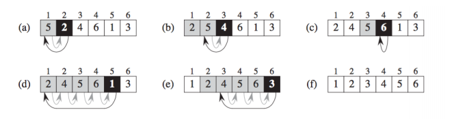
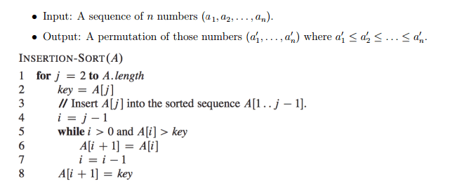

### 1. Assumptions
##### 1.1 算法的数学分析模型中，假设以下操作花费 constant time
- 算术运算：加、减、乘、除、取余、取下限、取上限 (add, subtract, multiply, divide, remainder, floor, ceiling)

- 数据操作：读取、存储、复制 (load, store, copy)

- 流程控制：条件分支、函数调用、返回

##### 1.2 其它一些假设
- 伪码描述中，对于排序序列都是从下标 1 开始

##### 1.3 算法复杂度分析
- `f(x) ∈ O(upperbound)` means `f` "grows no faster than" `upperbound`

- `f(x) ∈ Ɵ(justlikethis)` means `f` "grows exactly like" `justlikethis`

- `f(x) ∈ Ω(lowerbound)` means `f` "grows no slower than" `lowerbound`

算法复杂度一般使用 `大O` 表示法，描述的是上界，`worst case`

### 2. Insertion sort

##### 2.1 插入排序图解

- 整个排序序列，分为 "sorted part" 和 "unsorted part"，最开始只有第一个元素是属于 "sorted part"

- 浅灰色方格代表 "sorted part", 白色方格代表 "unsorted part", 深黑色方格代表 当前待处理元素, 浅灰色箭头代表 "move", 深灰色箭头代表 "copy"

- a-e 可代表最外层的 iterations

##### 2.2 插入排序伪码描述

