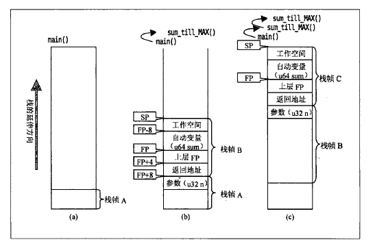

# 二、Intel架构的基本知识

---

### 1. 字节序
字节序影响着多字节数据在内存中的排列方式

- MSB
    Most Significant Bit, 最高有效位, 指二进制的高位比特。也可指高位字节。

- LSB
    Least Significant Bit, 最低有效位，值二进制中的低位比特。也可指低位字节。

- Big-Endian
    低地址存放的是MSB, 就是大端

- Little-Endian
    低地址存放的是LSB, 就是小端。*Intel架构都是小端*。

对于 0x12345678 这个 4字节数据，在内存中的存储方式：

    低地址     ->      高地址
    0x12    0x34    0x56    0x78        => 大端
    0x78    0x56    0x34    0x12        => 小端

### 2. 32位环境中的寄存器

- 8个通用32位寄存器
    - eax: 操作数的运算、结果
    - ebx:
    - ecx: 字符串操作、循环的计数器
    - edx:
    - esi:
    - edi:
    - esp: 栈指针
    - ebp: 栈的基址指针

- 6个16位段寄存器
    - cs: 代码段
    - ds: 数据段
    - es: 数据段
    - fs: 数据段
    - gs: 数据段
    - ss: 堆栈段

- 1个32位 EFLAGS 寄存器

- 1个32位 EIP 寄存器

- 除了这些常用的寄存器外，还有控制寄存器、调试寄存器等等

### 3. 地址
CPU可以通过内存总线访问到的地址称为物理地址。32位模式下最大为 64GB(2的36 次方, 地址线36根)。64位模式下, Intel的实现为 2的40次方(地址线40根)。

内存地址空间模型

- 平坦模型

    内存可以看做是单一、平坦的连续地址空间，称为线性地址空间。*Linux采用这种模型*

- 分段模型

    内存被分成段，通过段寄存器和偏移量组成的逻辑地址来访问段内地址

### 4. 栈
栈是程序存放数据的内存区域之一，先进后出。用来保存动态分配的自动变量，函数调用时用来保传递函数参数，保存函数地址和返回值

1. 例子程序： sum.c

    ```c
    #include <stdio.h>
    #include <ctype.h>
    #include <stdlib.h>
    #define MAX     (1UL << 20)


    typedef unsigned int u32;
    typedef unsigned long long u64;

    u32 max_addend = MAX;

    u64 sum_till_max(u32 n)
    {
        u64 sum;
        n++;
        sum = n;

        if (n<max_addend)
            sum += sum_till_max(n);

        return sum;
    }

    int main(int argc, char **argv)
    {
        u64 sum = 0;

        if ( (argc == 2) && isdigit(*(argv[1])) )
            max_addend = strtoul(argv[1], NULL, 0);
        if (max_addend > MAX || max_addend == 0) {
            fprintf(stderr, "Invalid number is specified\n");
            return 1;
        }

        sum = sum_till_max(0);
        printf("sum(0...%u) = %llu\n", max_addend, sum);


        return 0;
    }

    ```

    程序采用递归的方式求和

2. 栈上依次保存了*传给函数的参数、调用者的返回地址、上层栈帧指针和函数内部使用的自动变量*
    - stack frame

        FP 指针总是等于当前函数的 ebp

    - 在 sum_till_max 处设置断点，单步进入函数，查看汇编代码

        ```c
        main 函数部分汇编代码

        0x0804859f <+177>:   movl   $0x1,(%esp)                     # 参数压栈，传参给 n
        0x080485a6 <+184>:   call   0x80484b4 <sum_till_max>        # 调用函数sum_till_max，同时把函数的返回地址 0x080485ab 压栈
        0x080485ab <+189>:   mov    %eax,0x18(%esp)
        0x080485af <+193>:   mov    %edx,0x1c(%esp)


        sum_till_max 函数汇编代码

        0x080484b4 <+0>:     push   %ebp                            # 压栈上层栈帧指针
        0x080484b5 <+1>:     mov    %esp,%ebp                       # ebp寄存器保存新的栈帧指针
        0x080484b7 <+3>:     sub    $0x28,%esp                      # 分配保存自动变量的空间
        0x080484ba <+6>:     addl   $0x1,0x8(%ebp)                  # n++ 0x8(%ebp): 当前FP+8，即变量n
        0x080484be <+10>:    mov    0x8(%ebp),%eax
        0x080484c1 <+13>:    mov    %eax,-0x10(%ebp)
        0x080484c4 <+16>:    movl   $0x0,-0xc(%ebp)
        0x080484cb <+23>:    mov    0x804a020,%eax
        0x080484d0 <+28>:    cmp    %eax,0x8(%ebp)
        0x080484d3 <+31>:    jae    0x80484e6 <sum_till_max+50>
        0x080484d5 <+33>:    mov    0x8(%ebp),%eax
        0x080484d8 <+36>:    mov    %eax,(%esp)
        0x080484db <+39>:    call   0x80484b4 <sum_till_max>
        0x080484e0 <+44>:    add    %eax,-0x10(%ebp)
        0x080484e3 <+47>:    adc    %edx,-0xc(%ebp)
        0x080484e6 <+50>:    mov    -0x10(%ebp),%eax
        0x080484e9 <+53>:    mov    -0xc(%ebp),%edx
        0x080484ec <+56>:    leave
        0x080484ed <+57>:    ret
        ```
        

    - backtrace
        - backtrace 是通过搜索栈中保存的信息来实现的
        - `info registers eip ebp` 获取当前的执行位置和 FP(帧指针)
        - `x/40xw $esp` 查看栈中(内存)的数据
        - 假设目前断点停在sum_till_Max中，且是第二次调用
            ```c
            (gdb) bt
            #0  sum_till_max (n=1) at sum.c:15
            #1  0x080484e0 in sum_till_max (n=1) at sum.c:19
            #2  0x080485ab in main (argc=2, argv=0xffffd774) at sum.c:35

            (gdb) info registers $eip $ebp
            eip            0x80484ba        0x80484ba <sum_till_max+6>
            ebp            0xffffd678       0xffffd678                      # 帧0的FP, 当前FP

            (gdb) x/40xw $esp
            0xffffd650:     0xffffd8b8      0x00000005      0xffffffff      0x00000000

            0xffffd660:     0x08048260      0x0804a00c      0x00000000      0xf7fc3ff4
                                                                    64位变量sum
            0xffffd670:     0x00000000      0x00000000      0xffffd6a8      0x080484e0
                                                              帧1的FP        帧0的返回地址
            0xffffd680:     0x00000001      0x00000000      0x0000000a      0x00000000
                               参数n
            0xffffd690:     0xf7fc48c0      0xf7ff0a50      0x00000001      0x00000000

            0xffffd6a0:     0xffffd8b8      0xf7e54f56      0xffffd6d8      0x080485ab
                                                               帧2的FP       帧1的返回地址
            0xffffd6b0:     0x00000001      0x00000000      0x00000000      0xf7e53de5
                               参数n
            0xffffd6c0:     0xf7feb620      0x00000000      0x00000000      0x00000000

            0xffffd6d0:     0x080485f0      0xf7fc3ff4      0x00000000      0xf7e3a513
                                                                            帧2的返回地址
            0xffffd6e0:     0x00000002      0xffffd774      0xffffd780      0xf7fc8000
            ```

    - 栈溢出
        - 如果本例程序不带任何参数，就会无限递归调用sum_till_max，不断生成栈帧，消耗栈空间，导致栈溢出
        - `$ ulimit -s` 可以查看当前linux环境允许的栈的空间的最大值
