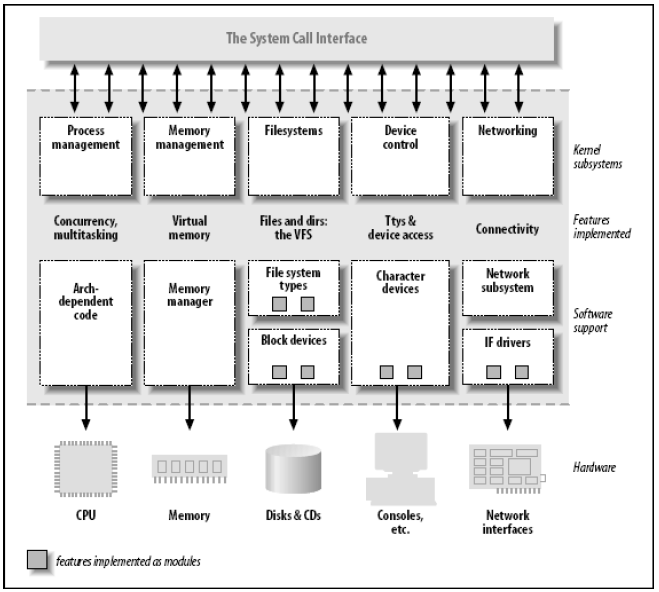

##### 1. Linux 内核划分
内核是一个大块的可执行文件，包含几个并发的进程专注于不同的任务。内核的角色可以划分为：

- 进程管理

    内核负责进程的创建、销毁、输入输出、进程间通信、调度等

- 内存管理

    内核为所有的进程都建立了一个虚拟地址空间，内核的不同部分与内存管理子系统通过一套函数调用交互

- 文件系统

    Linux中的任何东西都可以看做成文件，内核在非结构化的硬件之上建立了一个结构化的文件系统

- *设备控制*

    内核中必须嵌入系统中出现的每个外设的驱动

- 网络

    路由、地址解析、报文的收集识别分发工作必须由内核来管理

##### 2. 可加载模块
模块是指可以在运行时添加到内核的代码，Linux支持很多模块类型，设备驱动是其中的一个部分。内核通过 insmod 和 rmmod 程序去动态链接。

##### 3. 设备模块的分类

- 设备可分为三种类型
    - 字符设备

        字符设备是可以当作一个字节流来存取的设备。字符驱动负责实现这种行为。文本控制台、串口都是字符设备的例子。字符设备通过文件系统结点来存取。

    - 块设备

        块设备和字符设备的区别仅仅在内核内部管理数据的方式上，因此在内核/驱动的软件接口上不同。块设备也是通过文件系统结点来存取。

    - 网络接口

        网络事物都是通过接口来进行的。接口可以是硬件设备，比如网卡；也可以是软件设备，比如环回接口。网络接口负责接收和发送网络报文，对单个连接一无所知。网络接口有一个名字，比如 eth0，但在文件系统中没有结点。
